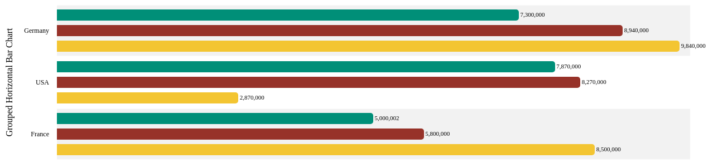

# ANGULAR FRAMEWORK NGX-CHARTS (12.0.0)

* [swimlane ngx-charts](https://swimlane.gitbook.io/ngx-charts)
    * [Grouped Horizontal Bar Chart](https://swimlane.github.io/ngx-charts/#/ngx-charts/bar-horizontal-2d)
    * [Grouped Horizontal Bar Chart: Tutorial](https://swimlane.gitbook.io/ngx-charts/examples/bar-charts/grouped-horizontal-bar-chart)
    * [Grouped Horizontal Bar Chart: Repo+Demo](https://stackblitz.com/edit/swimlane-grouped-horizontal-bar-chart)

